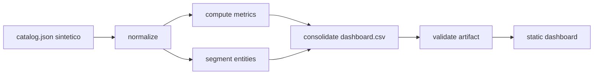

# EDU-24: pipeline, calidad y despliegue

## Flujo completo



## Ejecucion local

Desde `projects/project-02-education`:

```powershell
python scripts/build_education_dashboard_artifact.py data/synthetic/catalog.json data/synthetic/dashboard.csv
python scripts/validate_education_dashboard_artifact.py data/synthetic/dashboard.csv
python -m pytest -q tests/unit tests/smoke
python scripts/smoke_test_dashboard.py
python -m http.server 8083
```

Abrir `http://127.0.0.1:8083/dashboard/`.

## Controles de calidad

1. El contrato del catálogo valida metadata, geografía, unidades y
   observaciones.
2. La normalización conserva 60 observaciones y sus claves.
3. Las métricas derivadas se calculan sin convertir faltantes en cero.
4. La validación del consolidado rechaza duplicados, rangos inválidos y
   cobertura incompleta.
5. El smoke test confirma que las rutas estáticas responden.
6. Las pruebas E2E cubren filtros y responsive cuando Chromium está disponible.

## CI

El job `project-02-education` en `.github/workflows/ci.yml` regenera y valida
el artefacto, ejecuta unit/smoke y verifica que el CSV no esté vacío. El job
`quality` del repositorio principal permanece separado.

## Diagnostico rapido

| Señal | Causa probable | Accion |
| --- | --- | --- |
| CSV vacío | El pipeline no escribió la salida | Revisar permisos y ruta de salida |
| Clave duplicada | Datos repetidos por indicador-entidad-periodo | Corregir fuente antes de consolidar |
| HTTP 404 del dashboard | Servidor iniciado en una raíz incorrecta | Ejecutar desde Project 02 |
| `No se pudo cargar el dataset` | Falta `dashboard.csv` o ruta incorrecta | Regenerar el artefacto |
| E2E bloqueado | Chromium no instalado o runner no disponible | Instalar navegador en CI |

## Límites operativos

- El fixture es sintético y no representa datos oficiales.
- No se publican credenciales ni conexión de producción.
- El dashboard es estático; no sustituye un servicio de consulta.
- Las relaciones y segmentaciones son descriptivas, no causales.
